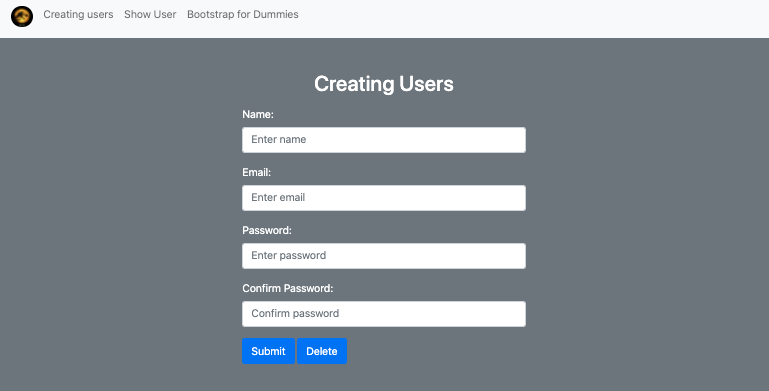
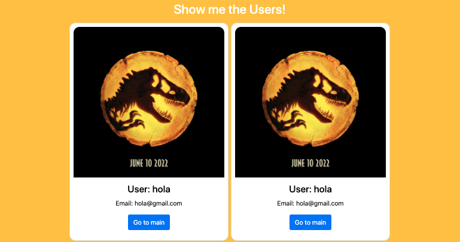

# Acerca del Proyecto-

## Bootstrap LocalStorage Proyecto

Este proyecto ha sido construido utilizando las tecnologías Bootstrap (HTML-CSS) y Javascript.

## Objetivo del Proyecto

EL objetivo de este proyecto ha sido poner en práctica los conocimientos adquiridos de Bootstrap y la gestion de datos en el LocalStorage de nuestro navegador.

Además hemos tenido que basarnos en la documentación oficial de BootStrap para poder rellenar una presentación de los conceptos fundamentales de BootStrap, cuyo enlace estará añadido en la misma página.

Crearemos un sencillo formulario que nos recogerá la siguiente información:

- Nombre del ususario.
- Email.
- Contraseña.
- Confirmación de contraseña

Mediante 2 botones incluidos en el formulario, podremos añadir usuarios o eliminarlos todos del LocalStorage.

Antes de proceder a añadirlos se realizará una validación de cada uno de los campos, cuando se den todas las condiciones, el usuario podrá ser añadido.

## Construido con...

_Este proyecto ha sido diseñado con las siguientes tecnologías:_

- BOOTSTRAP (HTML/CSS)
- JS

## Retos encontrados

Los principales retos encontrados han sido los generados por las 4 funciones necesarias para el desarrollo del proyecto:

- VALIDAR INFORMACIÓN DEL FORMULARIO

```
function fvalidate(e) {
  //e.preventDefault();
  if (
    name.value === '' ||
    mail.value === '' ||
    pass1.value === '' ||
    pass2.value === ''
  ) {
    msg.innerHTML = `<div class="alert alert-warning" role="alert">
    Please fill in all fields!
  </div>`;
  } else if (/(\w+?@\w+?\x2E.+)/.test(mail.value) !== true) {
    msg.innerHTML = `<div class="alert alert-warning" role="alert">
    Please enter a correct email!
  </div>`;
    //Please enter a correct email'
  } else if (pass1.value !== pass2.value) {
    //msg.innerHTML = 'Las dos contraseñas no son iguales';
    //`Las dos contraseñas no son iguales`
    msg.innerHTML = `<div class="alert alert-warning" role="alert">
    Please, put the same passwords!
  </div>`;
  } else if (
    /^(?=\w*\d)(?=\w*[A-Z])(?=\w*[a-z])\S{8,16}$/.test(pass1.value) !== true
  ) {
    //msg.innerHTML = 'Mínimo 8 caracteres, al menos una letra y un número';
    msg.innerHTML = `<div class="alert alert-warning" role="alert">
    Password must contain 8 characteres, one uppercase letter and one number!
  </div>`;
  } else {
    //msg.innerHTML = "Yeah, it's perfect Mate!";
    msg.innerHTML = `<div class="alert alert-warning" role="alert">
    Yeah, it's perfect Mate!!
  </div>`;
    fsubmit(e);
  }
  setTimeout(() => {
    msg.innerHTML = '';
  }, 3000);
}
```

- AÑADIR USUARIOS

```
function fsubmit(e) {
  e.preventDefault();
  let users = JSON.parse(localStorage.getItem('users')) || [];

  let users2 = {
    name: name.value,
    email: mail.value,
    pasword1: pass1.value,
    password2: pass2.value,
  };
  users.push(users2);
  localStorage.setItem('users', JSON.stringify(users));
  showUser.innerHTML = '';
  showScreen();
}

```

- MOSTRAR USUARIOS POR PANTALLA

Mostraremos los usuarios mediantes unas Bootstrap Cards creadas por defecto, las cuales mostraremos a través del DOM.

```
function showScreen() {
  let data = JSON.parse(localStorage.getItem('users'));
  for (let i = 0; i < data.length; i++) {
    //showUser.innerHTML += `<p>${data[i].name}</p><p>${data[i].email}</p>`;
    showUser.innerHTML += `<div class="card" style="width:400px">
    
    <div class="card-body">
      <h4 class="card-title">User: ${data[i].name}</h4>
      <p class="card-text">Email: ${data[i].email} </p>
      <a href="#" class="btn btn-primary">Go to main</a>
    </div>
  </div>`;
  }
}
```

- BORRAR USUARIOS

Borra todos los usuarios almacenados en LocalStorage

```
function fdelete() {
  //j.preventDefault();
  localStorage.clear();
  //Te borras los datos que te muestra en el div
  showUser.remove();
  //Te borra los datos de la consola
  console.clear();
}

```

### Instalación

Para poder visualizar el proyectos tendrás que clonarte el repositorio por medio del siguiente Link:

```
https://github.com/Vincecoorp21/THB---Bootstrap
```

#### Vista Previa




## Autores

Este proyecto ha sido desarrollado conjuntamente por:

👤 **Imanol Fuertes**

- Github: [@Imi21](https://github.com/Imi21)

👤 **Vince BC**

- Twitter: [@VinceTrend](https://twitter.com/VinceTrend)
- Github: [@Vincecoorp21](https://github.com/Vincecoorp21)
